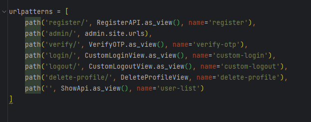
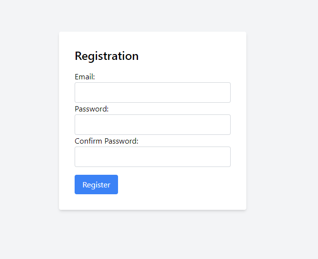
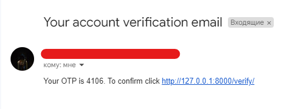
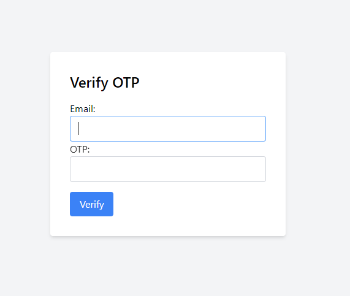
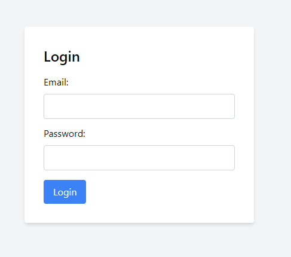
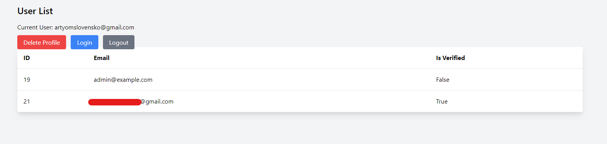
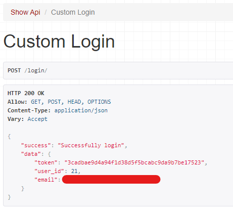
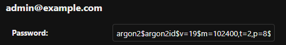

# Django Rest Framework Project README

Welcome to my Django Rest Framework project! This README provides an overview of the project's functionalities and how to use them.

## Features

### User Registration and OTP Verification

In this project, we have implemented a user registration system using email and password. After registering, users receive a 6-digit OTP code via email for profile confirmation.

### User Login and Logout

Users can log in using their email and password, and they can also log out when they're done.

### Profile Deletion

A profile deletion function is available for users who wish to remove their accounts.

### Authentication Options

We offer both session-based authentication and token-based authentication for enhanced security and user experience.

### Password Hashing

User passwords are securely hashed using the Argon algorithm to ensure maximum protection.

